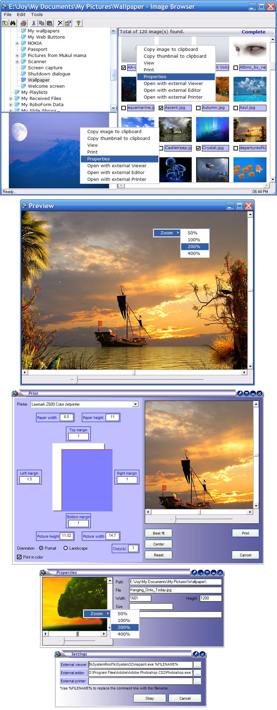



## Image\_Browser\_Explorer

### Description

DOWNLOAD THE SELF EXTRACTING FILE FROM http://rapidshare.com/files/11350072/Documentation.exe.html OR http://www.vb.kiev.ua/code/graph/ImageBrowserExplorer.zip AND INSTALL THE APPLICATION TO INSTALL ALL THE BINARY LIBRARIES AND OCXs (THE SFX WILL OPEN A LOCAL COPY OF THE DOCUMENTATION WEBSITE FOR YOU) OR PLEASE EMAIL ME FOR THE MISSING OCXS AT SKJOY2001[AT]YAHOO[DOT]COM

----

A simple image explorer like ACDSee but much simpler, primer, lightweight &amp; with source :) Explorer like navigation &amp; thumbnail view, preview, printing, etc. Thanks to GonChuki for his nice Chameleon button, other than that, all are mine develops. This has been done in complete OOP way.
 
### More Info
 

             |
---                |---
**Submitted On**   |2006-03-26 18:46:18
**By**             |[Broken Arrow](https://github.com/Planet-Source-Code/PSCIndex/blob/master/ByAuthor/broken-arrow.md)
**Level**          |Intermediate
**User Rating**    |4.9 (49 globes from 10 users)
**Compatibility**  |VB 6\.0
**Category**       |[Complete Applications](https://github.com/Planet-Source-Code/PSCIndex/blob/master/ByCategory/complete-applications__1-27.md)
**World**          |[Visual Basic](https://github.com/Planet-Source-Code/PSCIndex/blob/master/ByWorld/visual-basic.md)
**Archive File**   |[Image\_Brow1983223262006\.zip](https://github.com/Planet-Source-Code/broken-arrow-image-browser-explorer__1-64817/archive/master.zip)

